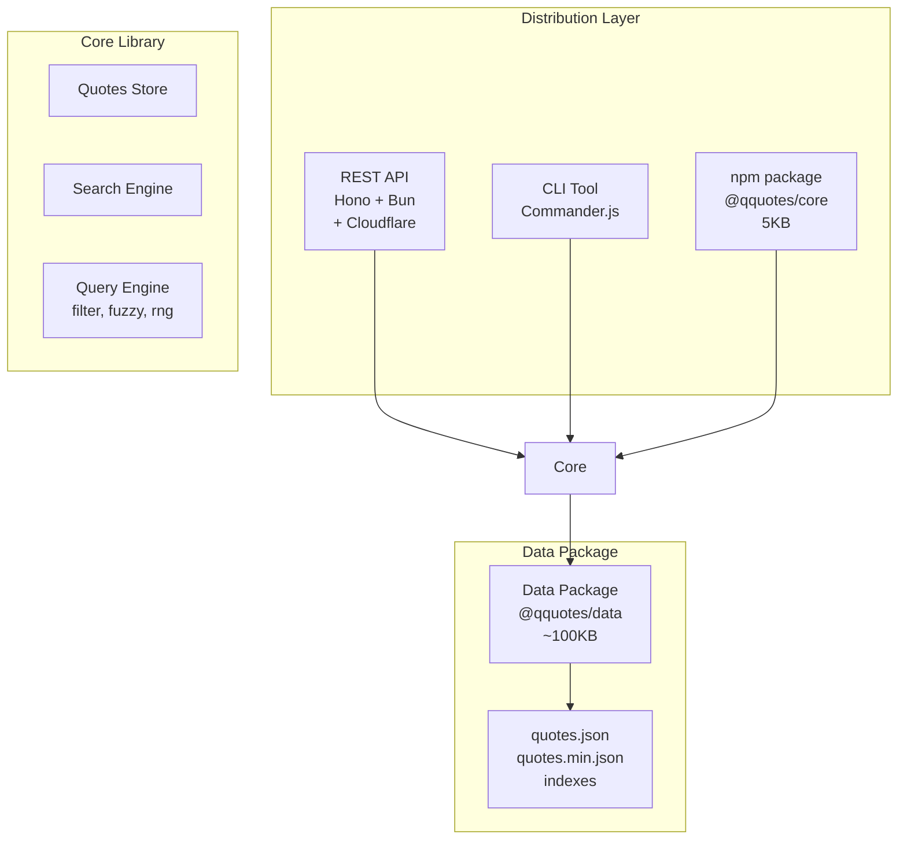

# System Design

## Architecture Diagram

## Technology Stack

### Core
| Component | Technology | Rationale |
|-----------|------------|-----------|
| Runtime | **Bun** | Fastest JS runtime, native TypeScript, built-in test runner |
| Language | **TypeScript 5.x** | Strict mode, satisfies operator, const type params |
| Validation | **Zod** | Runtime validation, type inference, excellent DX |
| Build | **tsup** | Zero-config, fast, ESM + CJS dual package |

### API Server
| Component | Technology | Rationale |
|-----------|------------|-----------|
| Framework | **Hono** | Ultra-fast, edge-ready, excellent TypeScript support |
| Hosting | **Cloudflare Workers** | Edge deployment, generous free tier, global distribution |
| Docs | **Scalar** (OpenAPI) | Modern API documentation UI |
| Logging | **hono-pino** | Lightweight structured logging for Hono |
| Rate Limiting | **@hono/rate-limiter** | Token bucket algorithm, edge-compatible |
| Search | **minisearch** | Lightweight full-text search with fuzzy matching |

### Development
| Component | Technology | Rationale |
|-----------|------------|-----------|
| Package Manager | **pnpm** | Fast, disk-efficient, strict dependency resolution |
| Monorepo | **Turborepo** | Fast builds, smart caching, remote cache support |
| Testing | **Bun test** | Fast, Jest-compatible, built-in coverage |
| Linting | **Biome** | Fast all-in-one linter/formatter (replaces ESLint + Prettier) |
| Git Hooks | **lefthook** | Fast, simple, no Node.js dependency for hooks |
| CI | **GitHub Actions** | Native, good caching, matrix builds |

### Quality
| Component | Technology | Rationale |
|-----------|------------|-----------|
| Type Coverage | **type-coverage** | Ensure no `any` types slip through |
| Bundle Analysis | **bundlephobia** + size-limit | Track bundle size in CI |
| Benchmarking | **mitata** | Accurate microbenchmarks |
